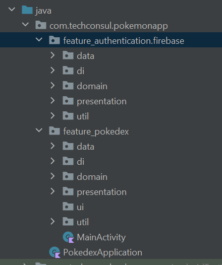

# PokemonApp

## Description

We all were children. Seeing our heroes battling evil guys with their powerful Pokemon, more or less powerful. Just thinking about it makes me enter the childhood again.
That's why I want to bring that feeling to every Pokemon lover that wanna live as a child again :D

By using the public Pokemon Api and accessing multiple endpoint this API provides, anybody, after **successful** registration can see their favorite Pokemon again.
User can visualize the status each Pokemon has by pressing on the Pokemon desired. A detail screen will open of that particular pokemon, and stats will be shown for it.

#Technical Specifications

## 1. Language used

Kotlin

## 2.Architecture

The application is constructed with on an MVVM Architecture that implements *clean architecture*.

## 3. Technologies used

Jetpack Compose, Firebase, Retrofit, OkHttp, Hilt, FLows, Coroutines, Mockito, JUnit, Palette

## 4. Project Structure
The project has two main features, "feature_authentication" and "feature_pokedex"

Authentication, as the name suggests, contains the logic, as well as the UI, for the authentication process. This is done via Firebase.
It is being contructed accordingly to "clean architecture" guidelines. 
The **input validation** is being done in the use_case, and by using a wrapper, the result of a response is being transmitted to the UI, first at ViewModel, which will 
let the UI know about the status via State.
Every request is processed via flows, respective callbackFlows, done inside Coroutines as for easing up the consumption of the main thread.
Custom messages are being displayed to the user, in case something goes wrong at server level. As well, by using the **InputValidator**, this will emit a message regarding
user's input when logging or registering to the application.

"feature_pokedex" contains the logic of the main application. It is built in clean architecture guidelines, as for better separating the logic by adding the use_case layer.
After succesfully being logged in, the user will be greeted by the "list screen". Am API call is made to fetch the data from the server, and after it reaches the viewModel,
the function "calculateDominantColor" will extract the dominant color from the image taken from the api and will display a gradient color on that pokemon's background/

Pagination is also present, loading new items from the server right to the user when he scrolls down. In case the user presses on a pokemon, a detail page will be opened.
There, a new call to the Api is being made, but to different endpoint, as to grab the status that pokemon has.
Each status sis displayed with diffrent color and using animations Jetpack Compose provides.

## 5. Testing

Using Mockito, creating fakeRepositories and using Compose rule, managed to test the features implemented.  

